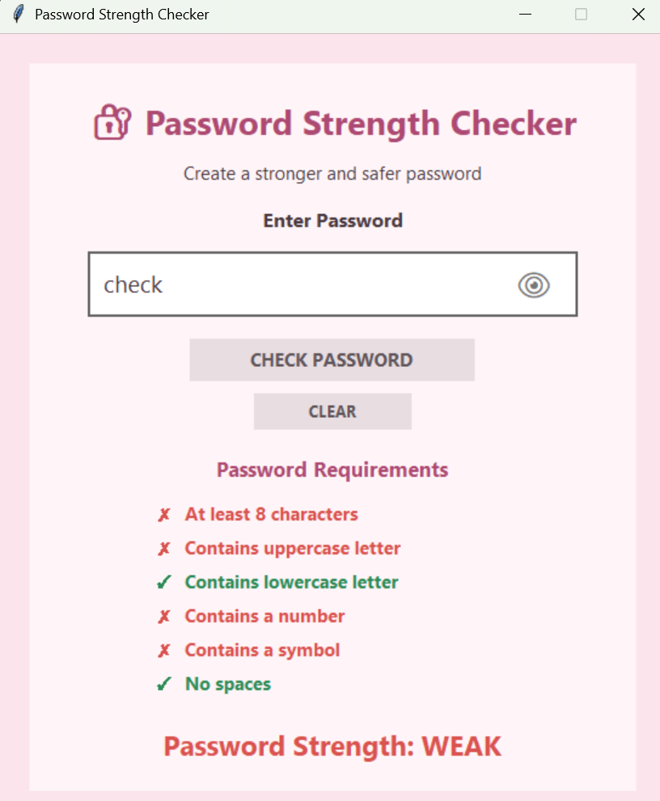
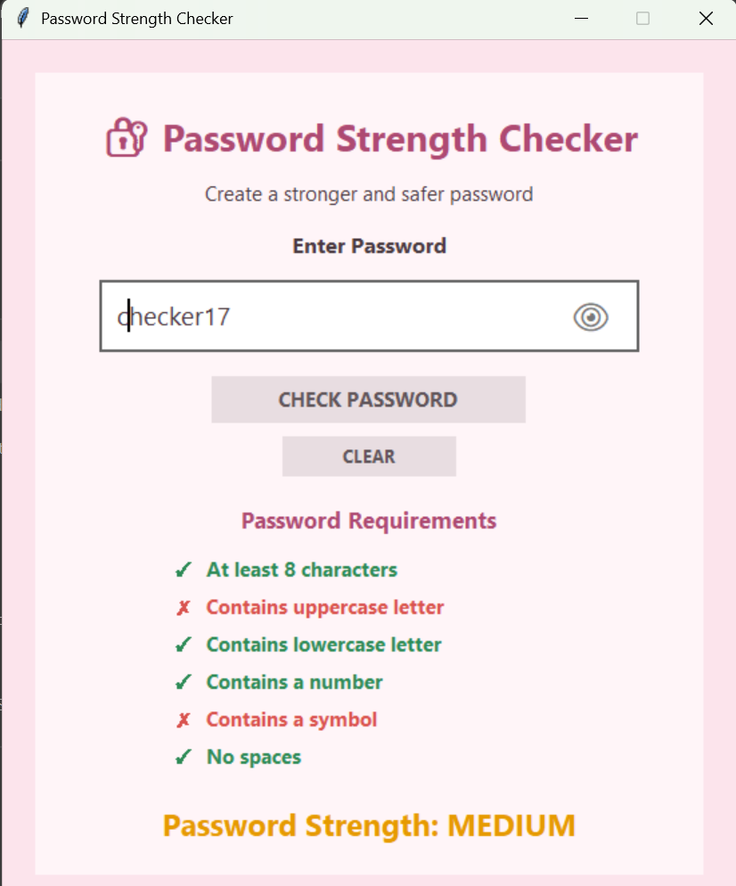
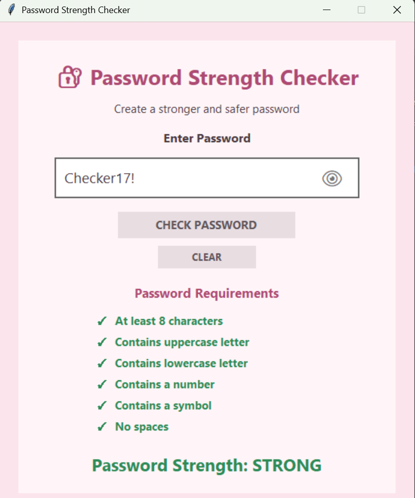

#  Password Strength Checker

A simple and user-friendly **Password Strength Checker** built with **Python and Tkinter**.

This application checks a password while the user is typing and shows whether it meets different password security requirements.

##  Features

* Checks password length
* Checks for uppercase letters
* Checks for lowercase letters
* Checks for numbers
* Checks for symbols
* Checks for spaces
* Shows ✓ when a requirement is fulfilled
* Shows ✗ when a requirement is not fulfilled
* Show/Hide password option
* Displays final password strength:

  * Weak
  * Medium
  * Strong
* Clear button to reset the application
* Simple and user-friendly graphical interface

##  Technologies Used

* Python
* Tkinter
* String handling
* Conditional statements
* Functions

##  Password Requirements

The application checks whether the password contains:

1. At least 8 characters
2. An uppercase letter
3. A lowercase letter
4. A number
5. A symbol
6. No spaces

##  How to Run

1. Make sure Python is installed.
2. Open the project in Visual Studio Code.
3. Open `password_app.py`.
4. Run the Python file.
5. Enter a password and check its strength.

##  Project Structure

```text
Password-Strength-Checker/
│
├── password_app.py
├── Screenshot.weak.png
├── Screenshot.medium.png
├── Screenshot.strong.png
└── README.md
```

##  Screenshots

### Weak Password



### Medium Password



### Strong Password



##  Project Purpose

This project was created to practice **Python programming, string handling, conditional statements, functions, and basic password security concepts**.
